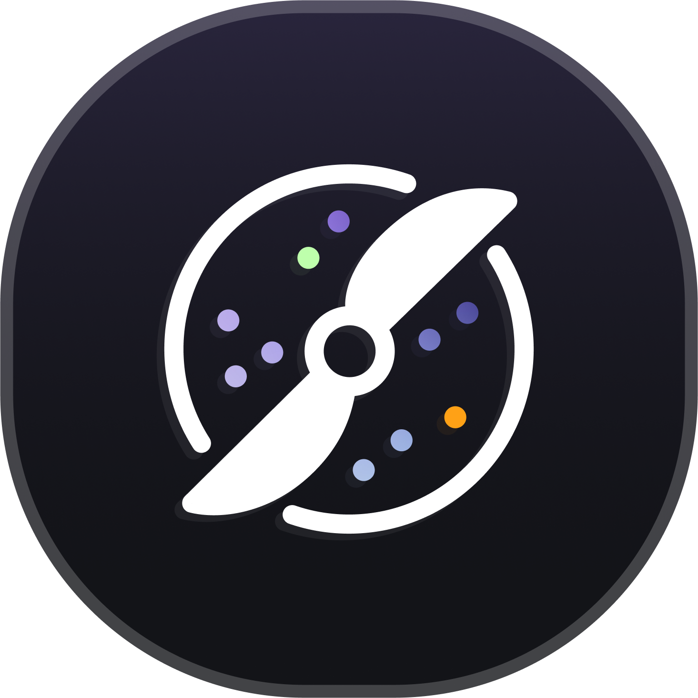

<div align="center">
   

   <h3>Grind.xyz</h3>
   <p align="center">
   A tracker repo for technical interview questions, patterns, and solutions
   </p>
   
   <div style="display: flex; width: 100%; justify-content: space-between;">
   
   
   

   
</div>

</div>

---
 
<br>

##  ⚡️ Commands


### ✹ Generate Question boilerplate
A command that generates a question's solutions, test and documentation file

**Properties/Values**

- `branchName` used to name the new added question's branch
- `folderName` used to target the question provider directories which is one of these (blind75, leetcode, ctci)
- `codeFileName` used to generate the kotlin solutions and test files in the specified `folderName` directory
- `docFileNameFileName` used to generate the question's document
 

 
```bash
make generate-question folderName="e.g. blind75" codeFileName="e.g. GroupAnagrams" docFileName="e.g 4.group-anagrams"
```

 

### ✹ Track Question
A command that tracks, commits and pushes file to the remote Github repo

**Properties**
1. `question` value is used in in the commit message containing all the staged added files
 

```bash
make track-files question="Group Anagrams"
```